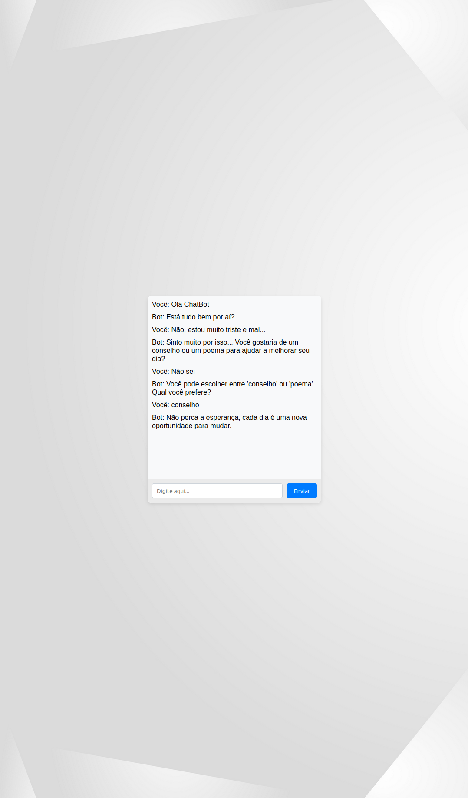

# PySpeakBot

PySpeakBot é um chatbot interativo desenvolvido com Python e Flask, projetado para proporcionar uma interface de conversação amigável. Este projeto inclui uma interface web que permite aos usuários interagir com o bot através de uma página HTML estilizada, oferecendo uma experiência de usuário suave e envolvente.

## Estrutura do Projeto

Aqui está a estrutura de diretórios do projeto PySpeakBot:

```
PySpeakBot/
│
├── app/ # Pasta principal para o código do aplicativo
│ ├── chatbot.py # Script Python do chatbot
│ └── server.py # Script Flask para servir a API e o frontend
│
├── templates/ # Pasta para arquivos HTML (para Flask)
│ └── index.html # Arquivo HTML principal
│
├── static/ # Pasta para arquivos estáticos como CSS e JavaScript
│ ├── styles.css # Arquivo CSS para estilização
│ └── script.js # Arquivo JavaScript para lógica frontend
│
└── requirements.txt # Dependências do projeto
```



## Instalação

Para instalar e configurar o PySpeakBot em sua máquina local, siga os passos abaixo:

1. **Clonar o Repositório:**

```
git clone https://github.com/seuusuario/PySpeakBot.git
```

2. **Navegar até o Diretório do Projeto:**

```
cd PySpeakBot
```

3. **Instalar Dependências:**
Usando pip, instale as dependências necessárias:

```
pip install -r requirements.txt
```

4. **Iniciar o Servidor Flask:**
Execute o servidor para acessar a interface do chatbot:

```
python app/server.py
```

Após iniciar o servidor, abra `http://127.0.0.1:5000/` em seu navegador para interagir com o chatbot.

## Uso

Após iniciar o servidor, o chatbot estará acessível através de seu navegador. Você pode começar a interagir com ele digitando mensagens no campo de texto providenciado e clicando em "Enviar" para ver as respostas do bot.

## Contribuições

Contribuições são bem-vindas! Se você tem melhorias ou novas funcionalidades em mente, sinta-se à vontade para fazer um fork do repositório e submeter suas mudanças através de um pull request.

## Licença

Este projeto é distribuído sob a Licença MIT, o que permite modificação e distribuição livre, desde que mantida a mesma licença no software derivado e reconhecimento ao autor original.

## Créditos

Desenvolvido por Felipe Braga Duarte. Agradeço a todos que contribuíram com o projeto, seja através de código, sugestões ou feedback.
